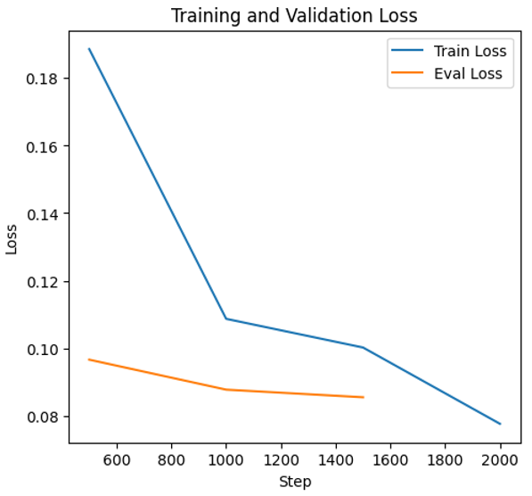
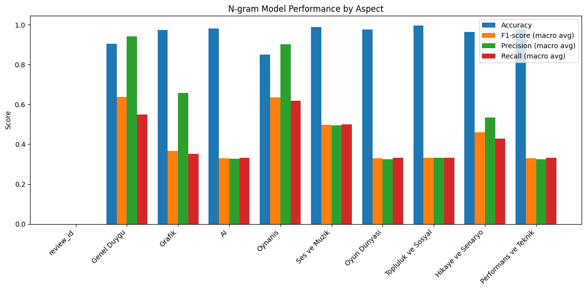

# Turkish Game Review Sentiment — Aspect Annotation and Course Study

**Graduate coursework at Özyeğin University — CS549, Natural Language Processing.** This private portfolio documents a team study of Turkish game reviews: identify whether a comment is positive, negative or neutral about graphics, AI and gameplay, rather than assign only one sentiment to the whole review.

## What problem was addressed?
“The graphics are good, but the AI is poor” contains opposing opinions about different aspects. The work explores preparing and labeling Turkish review text so that these opinions can be analyzed separately. Turkish word forms, slang, mixed sentiment and infrequent aspect mentions make both annotation and evaluation difficult.

## Emre's contribution
Team: **Emre Öztürk, Ali Baki Türköz and Demba Sow.** The supplied presentation credits Emre with co-leading literature review and paper writing, annotation, and feature-based labeling/filtering code. Demba led scraping and model training/testing. [Contribution and method details](docs/PROJECT_CONTEXT.md).

## What was done?
The presentation reports approximately **2,100 Turkish Steam reviews from 35 games**, cleaned and manually labeled by three researchers. Team methods include text cleanup, language filtering and Turkish morphological preprocessing, followed by Turkish BERT overall sentiment and a TF-IDF/logistic regression multi-output aspect baseline.

The repository includes selected original keyword-matching code, **three synthetic annotation examples**, and existing presentation outputs. Full reviews and original model-training code are not distributed. The tiny example file is unrelated to the reported model scores.

## Archived output and what it shows
| BERT epoch | Training loss | Validation loss | Validation accuracy |
|---|---:|---:|---:|
| 1 | 0.1886 | 0.0966 | 97.03% |
| 2 | 0.1087 | 0.0877 | 97.31% |
| 3 | 0.0776 | 0.0855 | 97.60% |

Source: presentation slide 14. These are archived team validation outputs; no training was rerun. Split indices, duplicate/leakage checks and an independent final test are not available here. Overall sentiment and individual aspect prediction use different targets. [Interpretation and unresolved schema issues](results/README.md).

*Unchanged presentation output. The saved epoch table and curve come from the supplied study, not the selected code excerpt.*

*Several aspects show high accuracy and much lower macro-F1. The source discusses neutral-label imbalance. The figure's review_id category and expanded aspect schema remain unresolved reporting issues.*

## Explore the materials
- [Selected original keyword-matching code](examples/keyword_matching_excerpt.py) and [scope](examples/README.md).
- [Synthetic annotation examples](data/synthetic_annotation_examples.csv).
- [Archived BERT table](results/bert_archived_epochs.csv) and [original table image](assets/bert_epoch_table.png).
- [Source and image manifest](docs/SOURCE_MANIFEST.json).

## Portfolio preparation and contact
Documentation and selected portfolio materials were prepared with **Codex and Claude assistance**, separately from the original team work. This repo remains **private**. Full material requests: **emre.ozturk.2098@gmail.com**.
